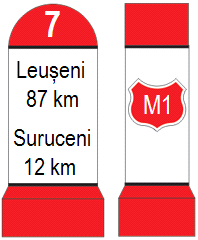
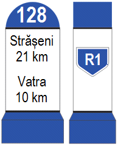
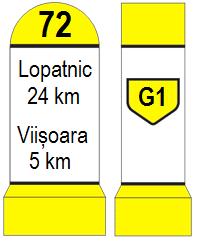

# Public Roads in Moldova

This page contains informations about public roads in Moldova

## Main Roads

* [List of Express Roads](express_roads.md) (Reference: M, red milestone)
---

* [List of Republican Roads](republican_roads.md) (Reference: R, blue milestone)
---

* [List of Regional Roads](regional_roads.md) (Reference: G, yellow milestone
---

## Local Roads

(Reference: L, green milestone)

* [List of local roads in Raionul Ocnița](.md)
* [List of local roads in Raionul Briceni](.md)
* [List of local roads in Raionul Edineț](.md)
* [List of local roads in Raionul Dondușeni](.md)
* [List of local roads in Raionul Soroca](.md)
* [List of local roads in Raionul Drochia](.md)
* [List of local roads in Raionul Rîșcani](.md)
* [List of local roads in Raionul Florești](.md)
* [List of local roads in Raionul Șoldănești](.md)
* [List of local roads in Raionul Rezina](.md)
* [List of local roads in Raionul Glodeni](.md)
* [List of local roads in Municipiul Bălți](.md)
* [List of local roads in Raionul Fălești](.md)
* [List of local roads in Raionul Sîngerei](.md)
* [List of local roads in Raionul Telenești](.md)
* [List of local roads in Raionul Orhei](.md)
* [List of local roads in Raionul Călărași](.md)
* [List of local roads in Raionul Ungheni](.md)
* [List of local roads in Raionul Nisporeni](.md)
* [List of local roads in Raionul Strășeni](.md)
* [List of local roads in Raionul Dubăsari](.md)
* [List of local roads in Raionul Criuleni](.md)
* [List of local roads in Municipiul Chișinău](.md)
* [List of local roads in Raionul Anenii Noi](.md)
* [List of local roads in Raionul Ialoveni](.md)
* [List of local roads in Raionul Hîncești](.md)
* [List of local roads in Raionul Leova](.md)
* [List of local roads in Raionul Cimișlia](.md)
* [List of local roads in Raionul Căușeni](.md)
* [List of local roads in Raionul Ștefan Vodă](.md)
* [List of local roads in Raionul Basarabeasca](.md)
* [List of local roads in Raionul Cantemir](.md)
* [List of local roads in Unitatea Teritorială Autonomă Găgăuzia](.md)
* [List of local roads in Raionul Taraclia](.md)
* [List of local roads in Raionul Cahul](.md)
* [List of local roads in Unitățile administrativ-teritoriale din stînga Nistrului](.md)
